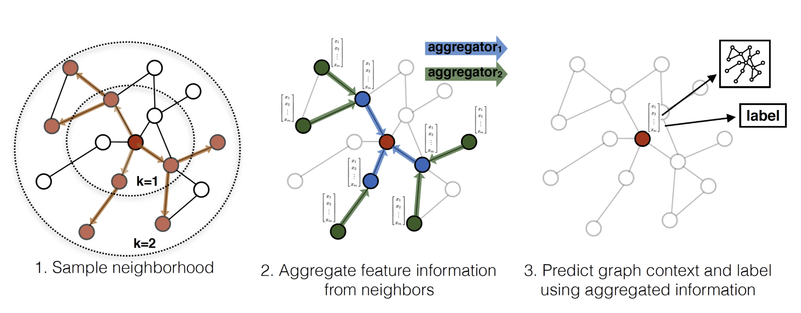

GraphSAGE Networks in PyTorch
====

PyTorch implementation of GraphSage, representation learning on large graphs using stochastic graph convolutions. [1].

For a high-level introduction to GraphSAGE, see:

William L. Hamilton, [Inductive Representation Learning on Large Graphs](https://github.com/williamleif/GraphSAGE) (2017)



Note: There are subtle differences between the TensorFlow implementation in https://github.com/williamleif/GraphSAGE and this PyTorch re-implementation. This re-implementation serves as a proof of concept and is not intended for reproduction of the results reported in [1].

For GraphSAGE networks, here we have two kinds of implementation, one is use pure numpy and PyTorch, the other is use torch-geometric and PyTorch.

## Requirements

  * Python 3.6
  * PyTorch 1.2.0
  * torch-cluster 1.4.5
  * torch-scatter 1.4.0
  * torch-sparse 0.4.3
  * torch-geometric 1.3.2

## Usage

```python train_graphsage.py```

```python train_GraphSAGE.py```


## References

[1] [William L. Hamilton, Rex Ying, Jure Leskovec, Inductive Representation Learning on Large Graphs, 2017](https://arxiv.org/pdf/1706.02216)