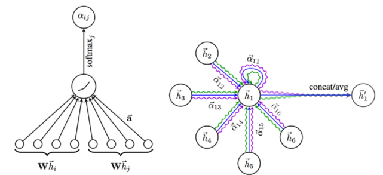

# Pytorch Graph Attention Network

This is a pytorch implementation of the Graph Attention Network (GAT)
model presented by Veličković et. al (2017, https://arxiv.org/abs/1710.10903).

Here we have three kinds of implementation of GAT, **GAT** is pure PyTorch implementation, **SpGAT** is a sparse version GAT using PyTorch and
**PyGAT** is a version of GAT using PyTorch torch_geometric.



# Performances

For the branch **master**, the training of the transductive learning on Cora task on a Titan Xp takes ~0.9 sec per epoch and 10-15 minutes for the whole training (~800 epochs). The final accuracy is between 84.2 and 85.3 (obtained on 5 different runs). 

A small note about initial sparse matrix operations of https://github.com/tkipf/pygcn. Therefore, the current model take ~7GB on GRAM.

A more fast version is use torch_geometric.

# Sparse version GAT

We develop a sparse version GAT using pytorch. There are numerically instability because of softmax function. Therefore, you need to initialize carefully. To use sparse version GAT, add flag `--sparse`. The performance of sparse version is similar with tensorflow. On a Titan Xp takes 0.08~0.14 sec.

## Usage

```python train_gat.py```

```python train_pyGAT.py```

# Requirements

 * Python 3.6
 * PyTorch 1.4.0
 * torch-scatter 2.0.3
 * torch-sparse 0.6.0
 * torch-geometric 1.4.2
